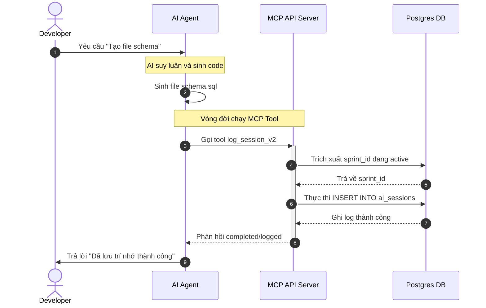

# Kiến trúc hệ thống: AI Memory & MCP Server

Tài liệu này mô tả cấu trúc kỹ thuật tổng quan của dự án, nhằm cung cấp năng lực lưu trữ "trí nhớ bền vững" (Persistent Memory) cho Antigravity (AI Agent) thông qua Model Context Protocol (MCP). Đảm bảo các AI thao tác trên dự án không bị mất đi bối cảnh công việc trải dài qua nhiều phiên trò chuyện khác nhau.

## 1. Mục tiêu kiến trúc

Thiết lập một ranh giới rõ ràng giữa AI suy luận (Client) và Dữ liệu cục bộ (Database), sử dụng MCP làm giao thức trung gian:
- **Ngữ cảnh (Context):** Duy trì sự liên tục giữa các phiên làm việc (Session) của AI.
- **Tiến độ (Sprint Tracking):** Chia nhỏ và quản lý công việc của AI trong các Sprint.
- **Tính trọn vẹn (Integrity):** Bằng cách gọi Tools trực tiếp, AI không cần tài khoản trực tiếp vào DB, tăng tính bảo mật và dễ debug.
- **Đa nền tảng (Agnostic):** Hỗ trợ tất cả các Editor chuẩn (Cursor, VS Code, Antigravity) nhờ thiết kế Dual-Mode (stdio + SSE).

---

## 2. Sơ đồ Các thành phần (Component Architecture Diagram)

Dưới đây là sơ đồ kiến trúc tổng thể, minh họa luồng xử lý Dual-mode mới nhất, cho phép linh hoạt giữa chạy script ngầm (stdio) dành cho Local IDE và chạy Web Server (SSE) cho môi trường Remote hoặc Dashboard:

```mermaid
graph TD
    subgraph ClientLayer["Các nền tảng Client"]
        Editor["AI Editors: Antigravity / Cursor / VS Code"]
        Dash["Streamlit Dashboard WebUI"]
    end

    subgraph MCPLayer["MCP Server Gateway (Python / FastMCP)"]
        DualMode{"Giao tiếp Dual-Mode"}
        CLI["stdio Interface"]
        SSE["SSE HTTP Transport :8000"]
        Router["Tool Handlers / safe_tool"]
        Watcher["Log Watcher (Tính năng mở rộng)"]
    end
    
    subgraph DBLayer["Tầng Dữ liệu Bền vững"]  
        DB[("PostgreSQL mcp_server_db")]
    end

    Editor -->|"Gọi lệnh python"| CLI
    Editor -.->|"Kết nối URL"| SSE
    CLI --> DualMode
    SSE --> DualMode
    DualMode --> Router
    Router -->|"psycopg2 SQL Pool"| DB
    Dash -->|"SQL Query trực tiếp"| DB
    Watcher -.->|"Phân tích Log"| DB

    classDef future fill:#f9f,stroke:#333,stroke-width:2px,stroke-dasharray: 5 5;
    class Watcher future;
```

### Các Module Cốt lõi

#### 2.1. Client Layer (Antigravity & Dashboard)
- **Antigravity AI Agent (MCP Client):** Gửi yêu cầu Tools Execute qua giao thức MCP để `manage_sprint` (Tạo, kiểm tra thẻ Sprint), `log_session_v2` (Lưu nhật ký công việc thực tế, logic, pending). Đóng vai trò là Actor thực thi mã và xử lý nghiệp vụ chính.
- **Dashboard (`D:\WORK\1.MCP_SERVER\dashboard`):** Ứng dụng Streamlit hiển thị trực quan dữ liệu. Cung cấp góc nhìn bao quát, giám sát trực quan các AI Session và Sprint Active qua View `v_sprint_monitoring`.

#### 2.2. Interface Layer (MCP Server)
- **Ngôn ngữ:** Python (FastAPI + FastMCP)
- **Cơ chế gọi:**
  - `stdio`: Khi chạy qua CLI (`python main.py`).
  - `HTTP/SSE`: Khi chạy kèm flag (`python main.py --sse`).
- **Vai trò:** Validate request từ AI, thiết lập Connection Pool (qua psycopg2) đến Postgres, xử lý các Exceptions và trả về JSON/Status cho AI.

#### 2.3. Data Layer (Postgres DB)
- Khởi chạy bằng Docker (`mcp_postgres` trên port `5434` ra host, port nội bộ `5432`).
- Lược đồ (Schema) chính:
  - `projects`: Lưu danh sách các Master Projects.
  - `sprints`: Tổ chức task logic theo mục tiêu, có trạng thái (`Active`, `Completed`).
  - `ai_sessions`: Lưu lịch sử mỗi tool call / logic mà AI đã dùng.

---

## 3. Data Workflow (Luồng dữ liệu hoạt động)

Sơ đồ trình tự (Sequence Diagram) dưới đây mô tả chính xác những gì xảy ra khi AI quyết định Ghi nhớ / Lưu log một tính năng vừa thiết kế:



### Giải thích Luồng Data Workflow
1. **Khởi nguồn:** Mọi thứ bắt đầu từ hành vi của người dùng và AI xử lý logic mã nguồn ngay tại Sandbox / Workspace.
2. **Kích hoạt:** Sau khi các file tĩnh (code) được xử lý xong, AI tự động chuyển hóa kiến thức đó thành dạng văn bản cô đọng (context/logic/pending tasks).
3. **Đóng gói MCP:** Dữ liệu này được bọc lại theo chuẩn giao thức MCP và đẩy qua `stdio` vào script Python.
4. **Adapter:** Server Python chuyển đổi JSON Payload thành cú pháp SQL an toàn qua Parametrized Query.
5. **Duyệt:** Cơ sở dữ liệu Postgres map chuẩn xác thông tin vào dự án và sprint, giúp cho các AI Agent từ những nền tảng khác nhau vẫn có thể nhặt ra xài chung nếu cần.

---

## 4. Đặc tả Môi trường & Triển khai

| Thành phần | Đường dẫn / Image | Port (Host) |
|---|---|---|
| PostgreSQL | `postgres:15-alpine` | `5434` |
| MCP Server (Docker) | `./mcp_server` | `8000` |
| Dashboard | `./dashboard` | `8501` |

*(File được cập nhật vào ngày 29/03/2026 bởi Antigravity)*
