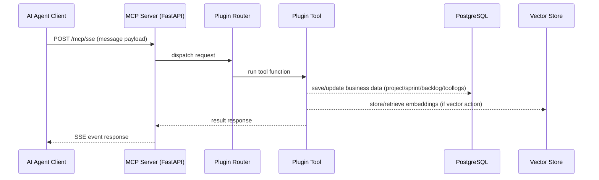
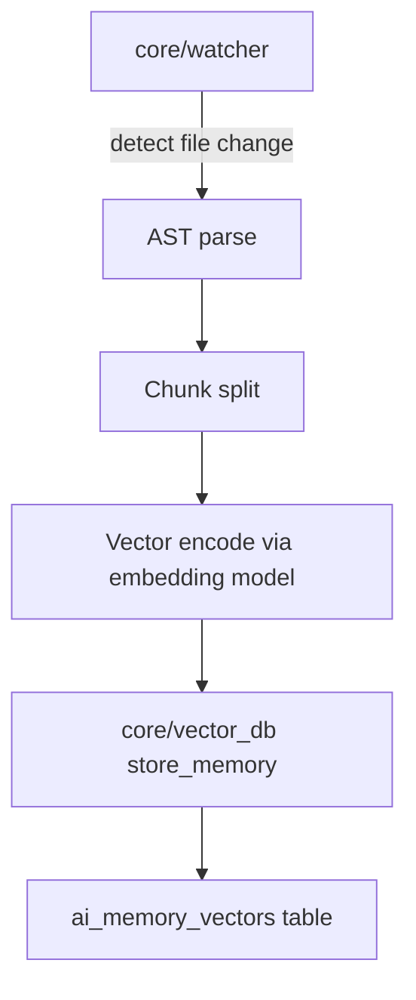

# MCP Commander: Architecture Audit (v2)

## 1. Purpose
- Provide an up-to-date architecture document for MCP Commander (MCP_COMMANDER_REMEDIATION).
- Capture full component audit, system boundaries, data workflows and extension points.
- Include visual diagrams (Mermaid) for architecture and data flows.

## 2. System components

### 2.1 Core MCP Server
- Location: `mcp_server/main.py`
- Framework: FastAPI + Starlette + FastMCP + custom SSE transport `SseServerTransport`.
- Entrypoints:
  - `/` status
  - `/mcp/sse` SSE-based MCP message stream
  - `/messages/` tool specific message channel.
- Initialization:
  - `register_all_tools(mcp)` from `plugins/__init__.py`.
  - `core.watcher.start_watcher()` starts file system watcher for code ingestion.

### 2.2 Plugins
- Directory layout: `mcp_server/plugins/*`
- Discovery mechanism: `plugins/__init__.py`, each plugin has `plugin.yaml` with "enabled" flag.
- Common interface: each plugin module defines `register_tools(mcp)`.
- Core plugin bundles:
  - `core_system`
  - `core_zero_waste`
  - `github_integration`
  - `antigravity_sync`

### 2.3 Data Persistence and Vector Store
- DB: PostgreSQL (module `core/database.py`), vector memory table `ai_memory_vectors`.
- Vector backend: `core/vector_db.py` with support for `pgvector` and `chroma`.
- Key tables:
  - `projects`
  - `sprints`
  - `backlog_items`
  - `ai_sessions`
  - `system_tool_logs`
  - `ai_memory_vectors`

### 2.4 Code watcher and AST ingestion
- Module: `core/watcher.py`.
- Purpose: scan project files, AST chunk into document pieces, persist in vector store.
- Frequency: directory watch + on-change ingestion.

### 2.5 Dashboard
- App: `dashboard/app.py` (Streamlit).
- Capabilities:
  - View projects/sprints/backlog
  - Manage plugin enable/disable
  - Search and monitoring
  - Visualize tool call logs

### 2.6 Runtime behaviors
- `core/ast_analyzer.py`: code structure extraction for analysis tools.
- `core/guard_tools`, `core/validator_tools`: safe execution and patch validation.
- `core/config.py`: settings and environment variable management.

## 3. Architecture diagram

```mermaid
flowchart LR
  subgraph AI Agent
    A[Agent Client (Llama/Gemini/etc)]
  end

  subgraph MCP Core
    B[FastAPI App]
    C[FastMCP] --> D[Routed Tool Plugins]
    B -.-> C
    D --> P1(core_system)
    D --> P2(core_zero_waste)
    D --> P3(github_integration)
    D --> P4(antigravity_sync)
  end

  subgraph Data Layer
    DB[(PostgreSQL + pgvector)]
    VEC[Vector DB Backend]
  end

  subgraph Dashboard
    S[Streamlit App]
  end

  A -->|SSE/JSON-RPC| B
  D -->|logs + metadata| DB
  D -->|vector store| VEC
  S -->|query| DB
  S -->|toggle plugins| P1
```

## 4. Data workflow diagrams

### 4.1 Tool request execution



### 4.2 Code ingestion pipeline (Watcher)



### 4.3 Rendering diagrams as images

For environments where Mermaid is not rendered automatically (e.g. plain Markdown viewers), generate static images with Mermaid CLI:

```bash
npm install -g @mermaid-js/mermaid-cli
mmdc -i docs/architecture/v2_architecture.md -o docs/architecture/v2_architecture.png
```

If global install is not permitted, use Docker:

```bash
docker run --rm -v "$PWD":/data minlag/mermaid-cli -i docs/architecture/v2_architecture.md -o docs/architecture/v2_architecture.png
```

Optionally, include generated files in the repository:
- `docs/architecture/v2_architecture.svg`
- `docs/architecture/v2_architecture.png`

#### Fallback text architecture overview

- AI agent sends SSE/JSON-RPC requests to MCP server.
- FastAPI routes requests into FastMCP plugin router.
- Plugins execute tools and write logs to PostgreSQL and vectors to ai_memory_vectors.
- Streamlit dashboard queries PostgreSQL for projects, sprints, backlog, and plugin state.
- File watcher ingests code changes through AST parser -> chunk -> embedding -> vector storage.

## 5. Audit findings (technical details)

- Plugin architecture is dynamic and minimal: no hardcoded tool list.
- Core components are loosely coupled; easier add new capabilities via plugin folder.
- Health endpoint exists in `main.py` and container healthcheck integration exists in `docker-compose`.
- Current gaps:
  - No auth/RBAC.
  - No production-grade circuit breaker, rate limits, and metrics.
  - No multi-cloud vector backend lifecycle management (PG only + chroma fallback).
  - No centralized event stream tracing (OpenTelemetry absent).

## 6. Recommendations (next steps)

### 6.1 Security & access control
- Add OAuth2/JWT for `/mcp/sse` and dashboard access.
- Enforce RBAC role in plugin invocation.
- Add ContentSecurityPolicy and CORS restrictions in FastAPI.

### 6.2 Stability & scaling
- Add worker queue (Celery/RQ) for long-running tools.
- Add packet size and rate limiting at SSE transport.
- Introduce retry/circuit-breaker decoraters for external integrations.

### 6.3 Observability
- Add structured logging (JSON) with request IDs.
- Add metrics endpoint (`/metrics`) + Prometheus exporter
- Add tracing with OpenTelemetry and Jaeger.

### 6.4 Data & memory
- Add multi-vector-backend adapter (Pinecone/Weaviate/Milvus).
- Add memory pruning/hard quota policy for `ai_memory_vectors`.

## 7. References
- `mcp_server/main.py`
- `plugins/__init__.py`
- `core/vector_db.py`
- `core/watcher.py`
- `dashboard/app.py`
- `mcp_server/plugins/core_system/mcp_commander_remediation_last_sync.md`
