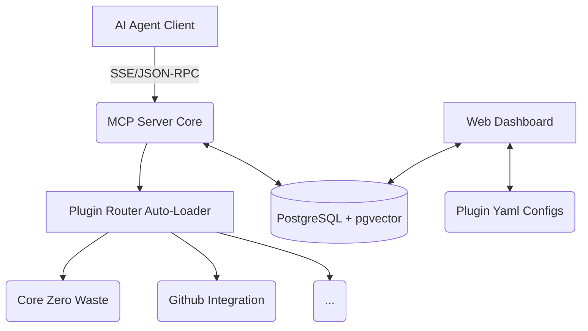

<h1 align="center">
  🚀 MCP Commander: Token-Efficient AI Platform
</h1>

<p align="center">
  A modular <b>Model Context Protocol (MCP) Server</b> focused on persistent memory, project tracking, and dashboard-driven operations for local AI agent workflows.
</p>

## ✨ Core Philosophy
**Stop Amnesia, Stop Unnecessary Iterations.**
This MCP Server empowers your AI Agent with a permanent memory architecture, rigorous context constraints, and a dynamic plugin ecosystem.

## 🌟 Key Features

### 🧩 1. Dynamic Plugin Matrix (Namespace Architecture)
Tools are grouped into plugins and loaded through the MCP server at startup.
- **Plugin Metadata:** Each plugin is described by `plugin.yaml`, including its tools, owner, and management surface.
- **Core Plugins Included:**
  - `core_system`: File manipulators, terminal execution, codebase analysis.
  - `core_zero_waste`: Context guards, AI Sandboxing (Patch diffing), semantic Vector Memory query.
  - `github_integration`: Native multi-stage Git & GitHub PR pipelines.
  - `antigravity_sync`: Direct memory tunneling to native AI UI Artifacts (Walkthroughs & Plans).

### 🖥️ 2. MCP Commander Dashboard (Streamlit & Docker)
A Streamlit dashboard for tracking projects, sprints, backlog items, logs, and plugin metadata.
- **Agile Backend:** Manage Projects, Sprints, and Backlogs directly inside PostgreSQL.
- **Tool Footprints:** Track tool invocations with sanitized parameters and summarized responses in `system_tool_logs`.
- **Toggle Features:** Hot-swap/Enable/Disable AI Plugins via a GUI directly writing to `plugin.yaml`.
- **Antigravity Brain Logs:** Visualize historical Architectures and Walkthroughs generated by previous AI sessions.

### 🧠 3. Persistent Semantic Memory (pgvector)
Built-in `PostgreSQL + pgvector` instances containerized by Docker.
Semantic retrieval is available when the embedding model is installed and reachable in the target environment.

---

## ⚡ Quickstart

### 1. Requirements
- Docker & Docker Compose
- Python 3.10+ (If running outside Docker)

### 2. Environment Setup
Configure your environment mapping. In the root directory or `mcp_server/.env`:
```env
# mcp_server/.env
DATABASE_URL=postgresql://mcp:mcp@db:5432/mcp_server_db
VECTOR_BACKEND=pgvector

# Mapping your Native AI Workspace generated artifacts to the Dashboard:
HOST_BRAIN_DIR=C:\Users\YOUR_NAME\.gemini\antigravity\brain
```

### 3. Launch
The default stack (DB, Dashboard, MCP Server) boots in a single command:
```bash
docker compose up -d --build
```

### 4. Endpoints
- **Streamlit Web Dashboard:** [http://localhost:8501](http://localhost:8501)
- **MCP Server (SSE Endpoint):** `http://localhost:8000/mcp/sse`

## 💻 VS Code / Antigravity Editor Setup
1. Open the workspace folder in VS Code: `d:\WORK\1.MCP_SERVER`.
2. Install recommended extensions: Python, Pylance, Docker, and Live Share (optional).
3. Create `.vscode/launch.json` using the following snippet:
```json
{
  "version": "0.2.0",
  "configurations": [
    {
      "name": "Python: Run MCP server",
      "type": "python",
      "request": "launch",
      "program": "${workspaceFolder}/mcp_server/main.py",
      "console": "integratedTerminal",
      "args": ["--sse"]
    }
  ]
}
```
4. Ensure `mcp_server/.env` is configured and `mcp_server/requirements.txt` installed: `pip install -r mcp_server/requirements.txt`.

### Antigravity Editor (Gemini UX) setup
1. Confirm mapping in `.env`:
```
HOST_BRAIN_DIR=C:\Users\YOUR_NAME\.gemini\antigravity\brain
```
2. Start the Antigravity local UI (if using local Gem workspace) and point its project root to `d:\WORK\1.MCP_SERVER`.
3. Open `readme.md`, plugin scripts and `mcp_server/main.py` in the Antigravity editor.
4. Start MCP server (WS and SSE) from terminal:
```bash
cd d:\WORK\1.MCP_SERVER
docker compose up -d --build
```
5. Use the Antigravity code browser to inspect `plugins/*` and in-editor tool execution logs.

## ⚠️ Current Scope
- The project is under active remediation and should be treated as development-stage, not production-ready.
- Git tools require the Docker workspace mount and `git` binary provided by the bundled `mcp_server/Dockerfile`.
- Semantic memory depends on the configured embedding model and vector backend availability.
- Authentication and fine-grained access control are not implemented yet.

---

## 🏗️ Architecture



## 🛡️ License
MIT License

## ⚖️ Disclaimer
- MCP Commander is provided "as-is".
- Users are fully responsible for deployment, operations, and security in their environments.
- No warranty for performance, security, or uptime. Intended for testing and development.
- Avoid using directly in production until auth/RBAC, logging, and error controls are fully implemented.
