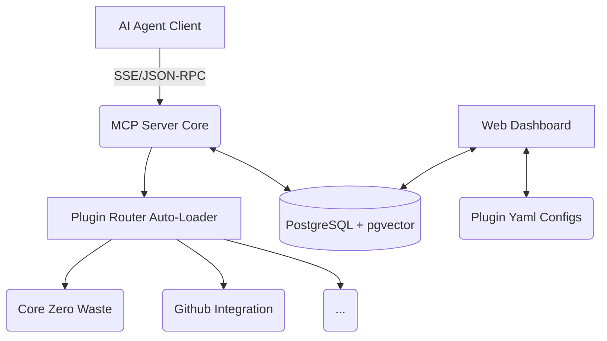

<h1 align="center">
  🚀 MCP Commander: Zero-Waste AI Platform
</h1>

<p align="center">
  A highly modular, production-ready <b>Model Context Protocol (MCP) Server</b> designed to transform any LLM AI Agent (Cursor, Windsurf, generic AI) into a persistent, autonomous, and zero-waste developer.
</p>

## ✨ Core Philosophy
**Stop Amnesia, Stop Unnecessary Iterations.**
This MCP Server empowers your AI Agent with a permanent memory architecture, rigorous context constraints, and a dynamic plugin ecosystem.

## 🌟 Key Features

### 🧩 1. Dynamic Plugin Matrix (Namespace Architecture)
Tools are not just files—they are managed ecosystems.
- **Auto-Discovery:** Just drop a Python file into `plugins/` and it instantly registers to the AI (Zero manual configs).
- **Core Plugins Included:**
  - `core_system`: File manipulators, terminal execution, codebase analysis.
  - `core_zero_waste`: Context guards, AI Sandboxing (Patch diffing), semantic Vector Memory query.
  - `github_integration`: Native multi-stage Git & GitHub PR pipelines.
  - `antigravity_sync`: Direct memory tunneling to native AI UI Artifacts (Walkthroughs & Plans).

### 🖥️ 2. MCP Commander Dashboard (Streamlit & Docker)
A fully visual web-dash to control your AI Agent.
- **Agile Backend:** Manage Projects, Sprints, and Backlogs directly inside PostgreSQL.
- **Tool Footprints:** Live-tracking of every single tool invoked by the AI Agent with full arguments/response logs.
- **Toggle Features:** Hot-swap/Enable/Disable AI Plugins via a GUI directly writing to `plugin.yaml`.
- **Antigravity Brain Logs:** Visualize historical Architectures and Walkthroughs generated by previous AI sessions.

### 🧠 3. Persistent Semantic Memory (pgvector)
Built-in `PostgreSQL + pgvector` instances containerized by Docker. 
AI Agents no longer forget logic: they actively search Semantic Data Vectors to recall exactly how they implemented features in the past.

---

## ⚡ Quickstart

### 1. Requirements
- Docker & Docker Compose
- Python 3.10+ (If running outside Docker)

### 2. Environment Setup
Configure your environment mapping. In the root directory or `mcp_server/.env`:
```env
# mcp_server/.env
DATABASE_URL=postgresql://mcp:mcp@db:5432/mcp_server_db
VECTOR_BACKEND=pgvector

# Mapping your Native AI Workspace generated artifacts to the Dashboard:
HOST_BRAIN_DIR=C:\Users\YOUR_NAME\.gemini\antigravity\brain
```

### 3. Launch
The entire stack (DB, Dashboard, MCP Server) boots in a single command:
```bash
docker compose up -d --build
```

### 4. Endpoints
- **Streamlit Web Dashboard:** [http://localhost:8501](http://localhost:8501)
- **MCP Server (SSE Endpoint):** `http://localhost:8000/mcp/sse`

---

## 🏗️ Architecture



## 🛡️ License
MIT License
